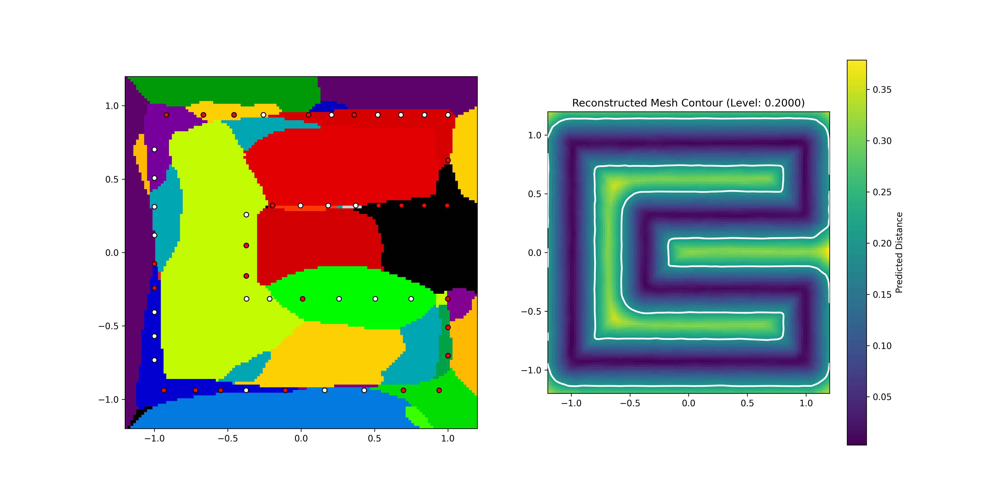

# Neural Distance Fields

Run script using  `python -m <folder.script>` (no `.py` at the end)

## Directory Structure

* **Meshes**: Input mesh
* **training3D**: Scripts for training and testing on 3D meshes
* **training2D**: Scripts for training and testing on 2D meshes
* **sirenTraining**: Scripts for SIREN training and testing
* **weightTrainingReLu**: Scripts for training and testing anchor weights on 2D meshes using ReLU activation
* **weightTrainingSiren**: Scripts for training and testing anchor weights on 2D meshes using SIREN architecture
* **weightTrainingSigma**: Scripts for training and testing anchor weights on 2D meshes using Sigmoid activation

---

## Results

### Reconstructed 3D meshes (unsigned distance field with Lipschitz loss)

### Reconstructed 2D meshes (unsigned distance field with Lipschitz loss)

  
  
  
  

### Influence diagrams and Contours

#### Trained with Softmax activation on the final layer (level: 0.2)

#### Trained with SIREN architecture (level: 0.2)

#### Trained with normalization formula on final layer and Signed distance fields as input

##### Using ReLU (level: 0.05)

##### Using Sigmoid (level: 0.2)

#### Trained with normalization formula on final layer and Unsigned distance fields as input

##### Using ReLU (level: 0.2)

##### Using Sigmoid (level: 0.2)
###### 500 epochs and 10000 points

###### 100 epochs and 100000 points
