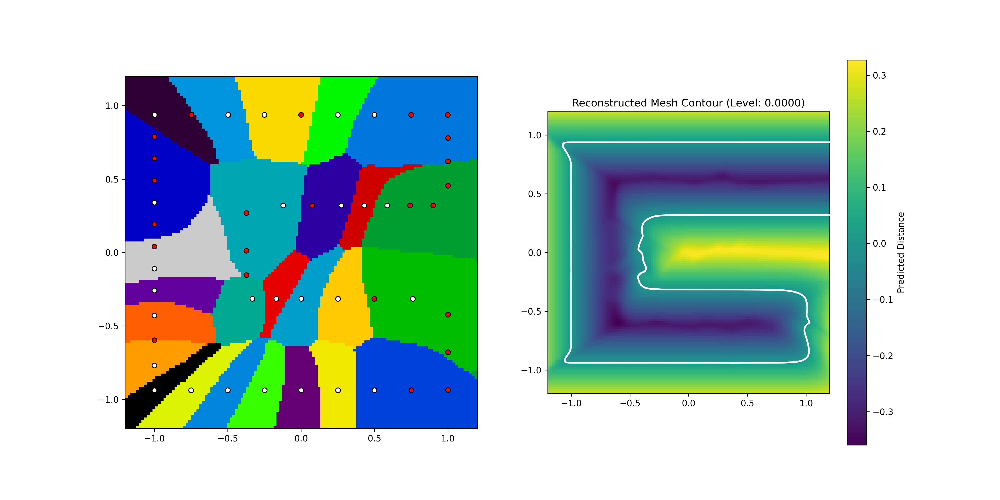
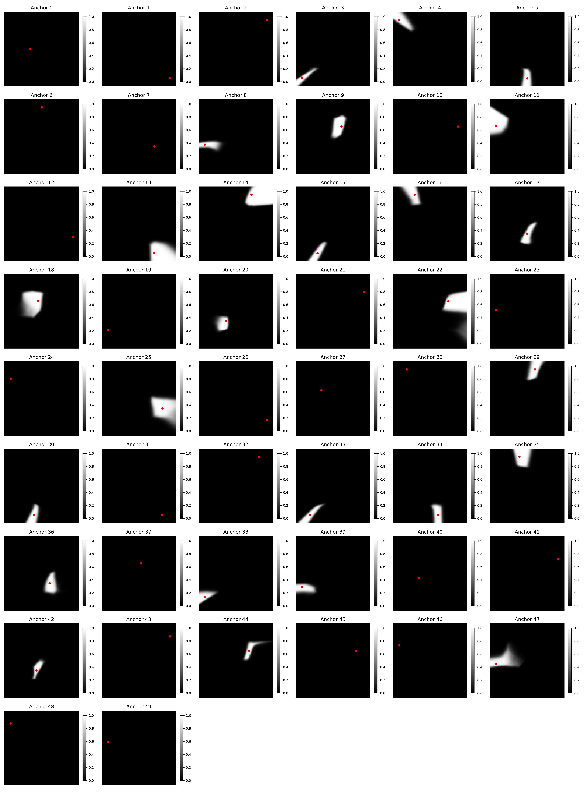
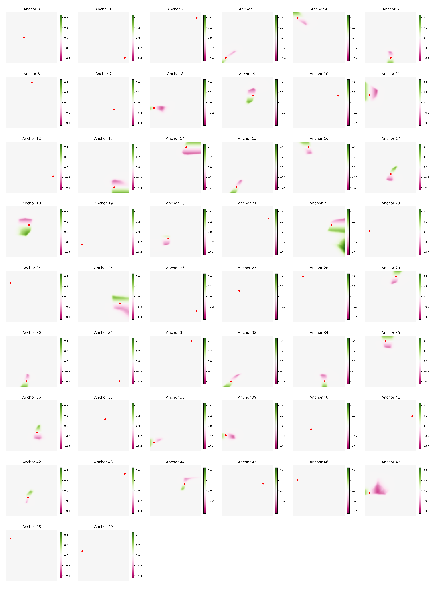
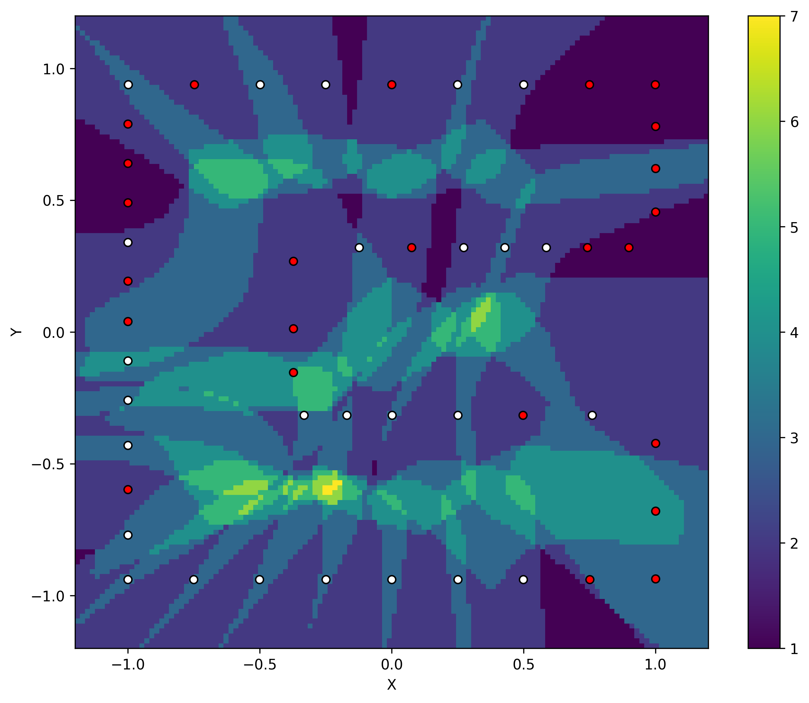
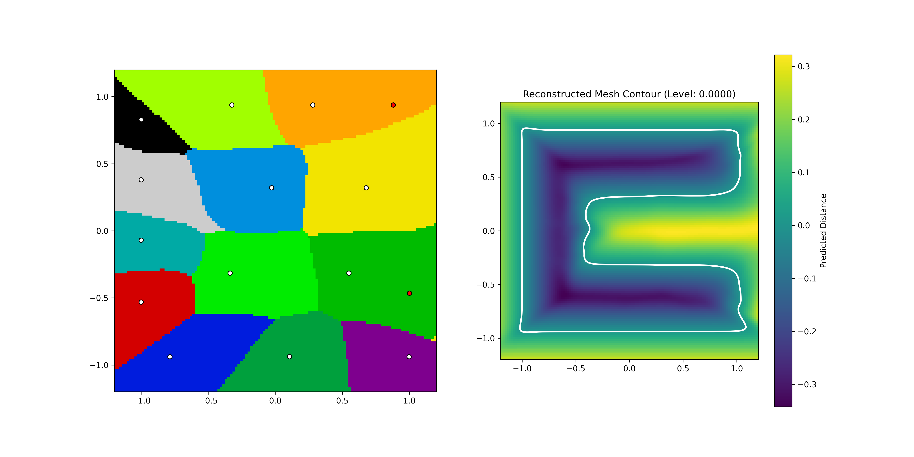
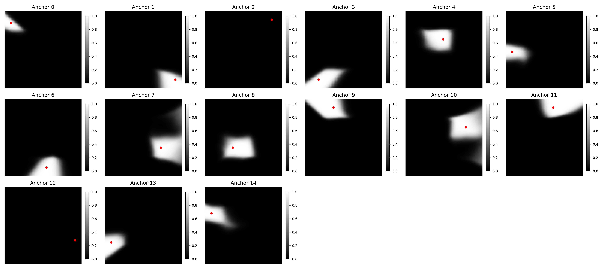
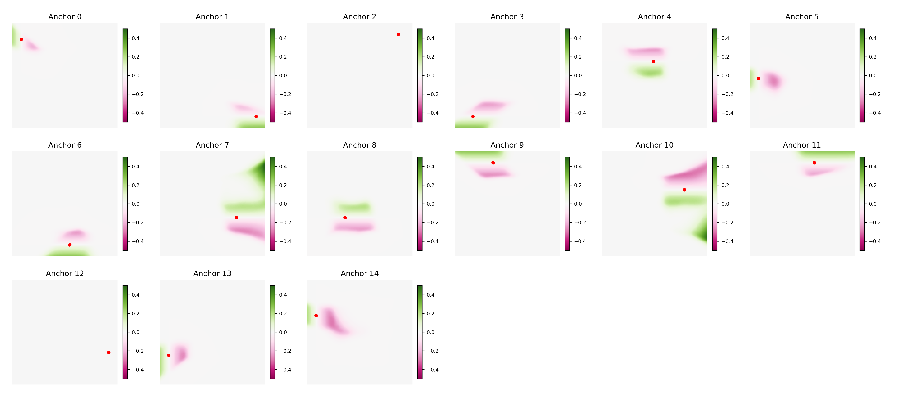
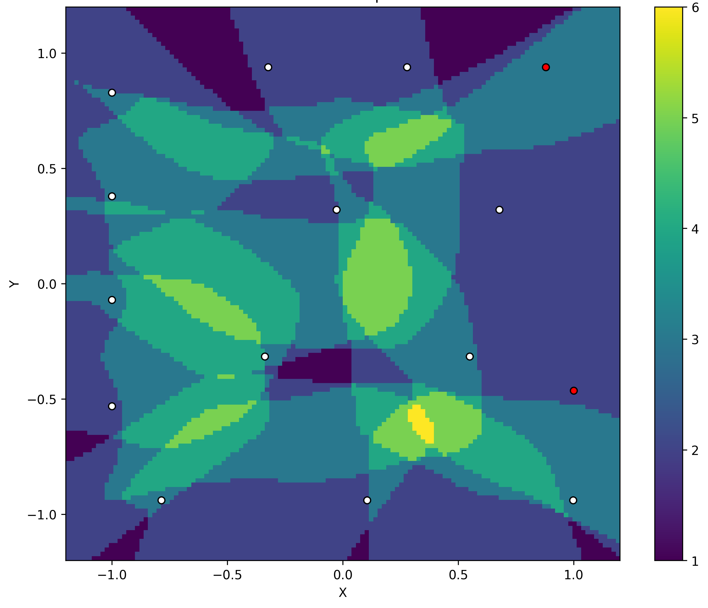

# Neural Distance Fields

Run script using  `python -m <folder.script>` (no `.py` at the end)

## Directory Structure

* **Meshes**: Input mesh
* **training3D**: Scripts for training and testing on 3D meshes
* **training2D**: Scripts for training and testing on 2D meshes
* **sirenTraining**: Scripts for SIREN training and testing
* **weightTrainingReLu**: Scripts for training and testing anchor weights on 2D meshes using ReLU activation
* **weightTrainingSiren**: Scripts for training and testing anchor weights on 2D meshes using SIREN architecture
* **weightTrainingSigma**: Scripts for training and testing anchor weights on 2D meshes using Sigmoid activation

---

### Reconstructed 3D meshes (unsigned distance field with Lipschitz loss)

### Reconstructed 2D meshes (unsigned distance field with Lipschitz loss)

  
  
  
  

---
## Training Unsigned Distance Fields

#### 1. Trained with Softmax activation on the final layer(level: 0.2)
[Link to code](weightTrainingRelu)
Best result with:
* input dimension: 2
* hidden dimension: 64
* number of layers: 4
* batch size: 128
* epochs: 100
* number of anchors: 35

Reconstructed Mesh Contour and Neural Voronoi Regions

Individual Anchor Influence Grids

#### 1.1 Trained with SIREN architecture (level: 0.2)
[Link to code](weightTrainingSiren)
Best result with:
* input dimension: 2
* hidden dimension: 128
* number of layers: 6
* frequency multiplier ($\omega$~0~): 5
*	scaling factor (c): 6
* batch size: 256
* epochs: 500
* number of anchors: 100

Reconstructed Mesh Contour and Neural Voronoi Regions

Individual Anchor Influence Grids

#### 2. Trained with normalization formula on final layer and Signed distance fields as input
[Link to code](weightTrainingSigma)

##### Using ReLU (level: 0.05)

Best result with:
* input dimension: 2
* hidden dimension: 64
* number of layers: 4
* batch size: 128
* epochs: 100
* number of anchors: 50

Reconstructed Mesh Contour and Neural Voronoi Regions

Individual Anchor Influence Grids

##### Using Sigmoid (level: 0.2)
Best result with:
* input dimension: 2
* hidden dimension: 64
* number of layers: 4
* batch size: 128
* epochs: 100
* number of anchors: 50

Reconstructed Mesh Contour and Neural Voronoi Regions

Individual Anchor Influence Grids

#### 3. Trained with normalization formula on final layer and Unsigned distance fields as input
[Link to code](weightTrainingSigma)

##### Using ReLU (level: 0.2)
Best result with:
* input dimension: 2
* hidden dimension: 64
* number of layers: 4
* batch size: 128
* epochs: 200
* number of anchors: 50

Reconstructed Mesh Contour and Neural Voronoi Regions

Individual Anchor Influence Grids

##### Using Sigmoid (level: 0.2)
Best result with:
* input dimension: 2
* hidden dimension: 64
* number of layers: 4
* batch size: 128
* epochs: 100
* number of anchors: 50
* number of random points: 100000

###### 500 epochs and 10000 points

Reconstructed Mesh Contour and Neural Voronoi Regions

Individual Anchor Influence Grids

###### 100 epochs and 100000 points

Reconstructed Mesh Contour and Neural Voronoi Regions

Individual Anchor Influence Grids

---
## Training Signed Distance Fields

#### 1. Trained with Softmax activation on the final layer
[Link to code](signedWeightTraining)
Best result with:
* input dimension: 2
* hidden dimension: 64
* number of layers: 4
* batch size: 128
* epochs: 100
* number of anchors: 50

Reconstructed Mesh Contour and Neural Voronoi Regions

Individual Anchor Influence Grids

#### 2. Trained with normalization formula on final layer using Sigmoid
[Link to code](signedWeightTrainingSigma)
Best result with:
* input dimension: 2
* hidden dimension: 64
* number of layers: 4
* batch size: 128
* epochs: 100
* number of anchors: 50

Reconstructed Mesh Contour and Neural Voronoi Regions

Individual Anchor Influence Grids

#### 3. Trained with normalization formula on final layer using Softmax and loss function
[Link to code](signedWeightTrainingLoss)
Best result with:
* input dimension: 2
* hidden dimension: 64
* number of layers: 4
* batch size: 128
* epochs: 100
* number of anchors: 50

###### 50 anchors

Reconstructed Mesh Contour and Neural Voronoi Regions

Individual Anchor Influence Grids

Anchor * Distance Influence Grids

Anchor Influence per Point

###### 15 anchors

Reconstructed Mesh Contour and Neural Voronoi Regions

Individual Anchor Influence Grids

Anchor * Distance Influence Grids

Anchor Influence per Point

