# Neural Distance Fields <!-- omit from toc -->

Run script using  `python -m <folder.script>` (no `.py` at the end)

## Tabel of Contents <!-- omit from toc -->
- [Directory Structure](#directory-structure)
  - [Reconstructed 3D meshes (unsigned distance field with Lipschitz loss)](#reconstructed-3d-meshes-unsigned-distance-field-with-lipschitz-loss)
  - [Reconstructed 2D meshes (unsigned distance field with Lipschitz loss)](#reconstructed-2d-meshes-unsigned-distance-field-with-lipschitz-loss)
- [Training Unsigned Distance Fields](#training-unsigned-distance-fields)
    - [1. Trained with Softmax activation on the final layer(level: 0.2)](#1-trained-with-softmax-activation-on-the-final-layerlevel-02)
    - [1.1 Trained with SIREN architecture (level: 0.2)](#11-trained-with-siren-architecture-level-02)
    - [2. Trained with normalization formula on final layer and Signed distance fields as input](#2-trained-with-normalization-formula-on-final-layer-and-signed-distance-fields-as-input)
      - [Using ReLU (level: 0.05)](#using-relu-level-005)
      - [Using Sigmoid (level: 0.2)](#using-sigmoid-level-02)
    - [3. Trained with normalization formula on final layer and Unsigned distance fields as input](#3-trained-with-normalization-formula-on-final-layer-and-unsigned-distance-fields-as-input)
      - [Using ReLU (level: 0.2)](#using-relu-level-02)
      - [Using Sigmoid (level: 0.2)](#using-sigmoid-level-02-1)
        - [500 epochs and 10000 points](#500-epochs-and-10000-points)
        - [100 epochs and 100000 points](#100-epochs-and-100000-points)
- [Training Signed Distance Fields](#training-signed-distance-fields)
    - [1. Trained with Softmax activation on the final layer](#1-trained-with-softmax-activation-on-the-final-layer)
    - [2. Trained with normalization formula on final layer using Sigmoid](#2-trained-with-normalization-formula-on-final-layer-using-sigmoid)
    - [3. Trained with normalization formula on final layer using Softmax and loss function](#3-trained-with-normalization-formula-on-final-layer-using-softmax-and-loss-function)
        - [50 anchors](#50-anchors)
        - [15 anchors](#15-anchors)
- [Experiments for better contours + loss function](#experiments-for-better-contours--loss-function)
  - [U mesh](#u-mesh)
    - [A. Changing number of anchors and epochs](#a-changing-number-of-anchors-and-epochs)
      - [1. 15 anchors](#1-15-anchors)
      - [2. 50 anchors](#2-50-anchors)
      - [3. 200 anchors](#3-200-anchors)
    - [B. Changing the influence factor of the loss (lm)](#b-changing-the-influence-factor-of-the-loss-lm)
    - [C. Best result (50 anchors; 300 epochs) with change in lm](#c-best-result-50-anchors-300-epochs-with-change-in-lm)
  - [Dolphin mesh](#dolphin-mesh)
    - [A. Changing number of anchors and epochs](#a-changing-number-of-anchors-and-epochs-1)
      - [1. 50 anchors](#1-50-anchors)
      - [2. 100 anchors](#2-100-anchors)
      - [3. 200 anchors](#3-200-anchors-1)
    - [B. Changing the influence factor of the loss (lm)](#b-changing-the-influence-factor-of-the-loss-lm-1)
      - [1. 100 epochs](#1-100-epochs)
      - [2. 300 epochs](#2-300-epochs)
      - [3. 500 epochs](#3-500-epochs)
    - [C. Best result](#c-best-result)
  - [Horse mesh](#horse-mesh)
    - [A. Changing number of anchors and epochs](#a-changing-number-of-anchors-and-epochs-2)
      - [1. 300 anchors](#1-300-anchors)
      - [2. 500 anchors](#2-500-anchors)
    - [B. Changing the influence factor of the loss (lm)](#b-changing-the-influence-factor-of-the-loss-lm-2)
      - [1. 300 epochs](#1-300-epochs)
  - [Dragon mesh](#dragon-mesh)
    - [A. Changing number of anchors and epochs](#a-changing-number-of-anchors-and-epochs-3)
      - [1. 100 anchors](#1-100-anchors)
      - [2. 300 anchors](#2-300-anchors)
      - [3. 500 anchors](#3-500-anchors)
    - [B. Changing the influence factor of the loss (lm)](#b-changing-the-influence-factor-of-the-loss-lm-3)
      - [1. 300 anchors](#1-300-anchors-1)
      - [2. 500 anchors](#2-500-anchors-1)
  - [Comparison](#comparison)
  - [Experiments](#experiments)
- [Experiments with sigmoid activation function](#experiments-with-sigmoid-activation-function)
- [Experiments with sin activation function](#experiments-with-sin-activation-function)
    - [A. Diferent architecture dimensions](#a-diferent-architecture-dimensions)
    - [B. Different values for w0](#b-different-values-for-w0)
    - [C. Different number of anchors](#c-different-number-of-anchors)
    - [D. Lower lambda factor](#d-lower-lambda-factor)
    - [E. Best result](#e-best-result)
    - [F. Other meshes](#f-other-meshes)
- [Experiments with Gaussian activation function](#experiments-with-gaussian-activation-function)
    - [100 epochs](#100-epochs)
    - [300 epochs](#300-epochs)
    - [500 epochs](#500-epochs)
- [Experiments with cross-entropy loss](#experiments-with-cross-entropy-loss)
  - [U mesh](#u-mesh-1)
    - [A. Changing number of anchors - 50 ceEpochs](#a-changing-number-of-anchors---50-ceepochs)
    - [B. Changing number of ceEpochs - 20 anchors](#b-changing-number-of-ceepochs---20-anchors)
  - [Dolphin mesh](#dolphin-mesh-1)
    - [A. Changing number of anchors - 50 ceEpochs](#a-changing-number-of-anchors---50-ceepochs-1)
    - [B. Changing number of ceEpochs - 100 anchors](#b-changing-number-of-ceepochs---100-anchors)
  - [Horse mesh](#horse-mesh-1)
    - [A. Changing number of anchors - 50 ceEpochs](#a-changing-number-of-anchors---50-ceepochs-2)
    - [B. Changing number of ceEpochs - 100 anchors](#b-changing-number-of-ceepochs---100-anchors-1)
  - [Dragon mesh](#dragon-mesh-1)
    - [A. Changing number of anchors - 50 ceEpochs](#a-changing-number-of-anchors---50-ceepochs-3)
    - [B. Changing number of ceEpochs - 200 anchors](#b-changing-number-of-ceepochs---200-anchors)
  - [Results using only the cross-entropy](#results-using-only-the-cross-entropy)
    - [Dolphin - 50 anchors](#dolphin---50-anchors)
    - [Dolphin - 100 anchors](#dolphin---100-anchors)
    - [Horse - 100 anchors](#horse---100-anchors)
    - [Dragon - 200 anchors](#dragon---200-anchors)
- [Experiments with cross-entropy loss and sparsemax activation](#experiments-with-cross-entropy-loss-and-sparsemax-activation)
  - [Dolphin mesh - 100 anchors](#dolphin-mesh---100-anchors)
    - [1. Sparsemax](#1-sparsemax)
    - [2. Entmax15](#2-entmax15)
  - [Dragon mesh - 200 anchors](#dragon-mesh---200-anchors)
    - [1. Sparsemax](#1-sparsemax-1)
    - [2. Entmax15](#2-entmax15-1)
  - [Comparison between training with cross-entropy, SDF or both](#comparison-between-training-with-cross-entropy-sdf-or-both)
    - [Dolphin - 50 anchors](#dolphin---50-anchors-1)
    - [Horse - 100 anchors](#horse---100-anchors-1)
    - [Dragon - 200 anchors](#dragon---200-anchors-1)

## Directory Structure

* **signedWeightTraining**: Scripts for training and testing anchor weights on 2D meshes using ReLU activation
* **signedWeightTrainingLoss**: Scripts for training and testing anchor weights on 2D meshes using Sigmoid activation and loss function
* **signedWeightTrainingSigma**: Scripts for training and testing anchor weights on 2D meshes using Sigmoid activation
* **sirenTraining**: Scripts for SIREN training and testing
* **Meshes**: Input mesh
* **training3D**: Scripts for training and testing on 3D meshes
* **training2D**: Scripts for training and testing on 2D meshes
* **weightTrainingReLu**: Scripts for training and testing anchor weights on 2D meshes using ReLU activation
* **weightTrainingSigma**: Scripts for training and testing anchor weights on 2D meshes using Sigmoid activation
* **weightTrainingSiren**: Scripts for training and testing anchor weights on 2D meshes using SIREN architecture

---

### Reconstructed 3D meshes (unsigned distance field with Lipschitz loss)
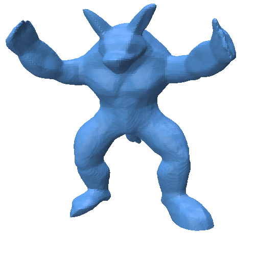

### Reconstructed 2D meshes (unsigned distance field with Lipschitz loss)

  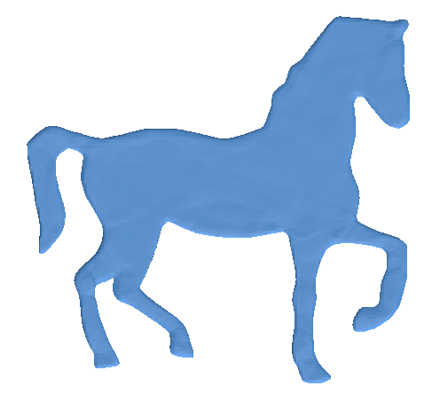
  
  
  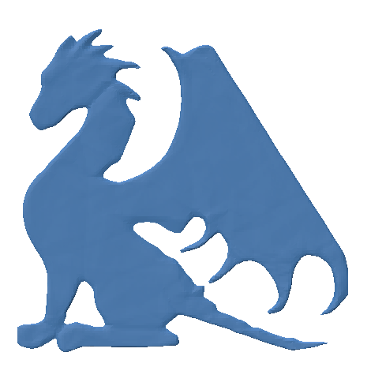

---
## Training Unsigned Distance Fields

#### 1. Trained with Softmax activation on the final layer(level: 0.2)
[Link to code](weightTrainingRelu)
Best result with:
* input dimension: 2
* hidden dimension: 64
* number of layers: 4
* batch size: 128
* epochs: 100
* number of anchors: 35

Reconstructed Mesh Contour and Neural Voronoi Regions

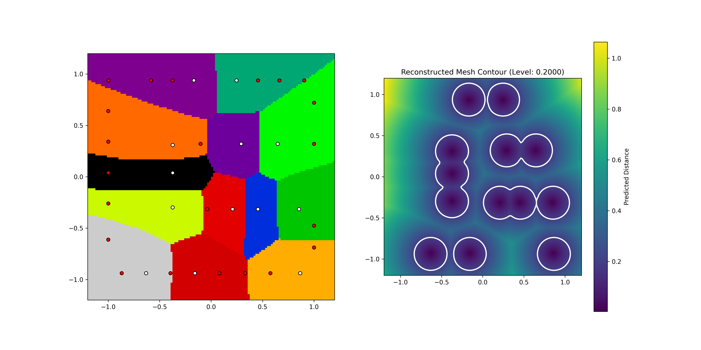

Individual Anchor Influence Grids

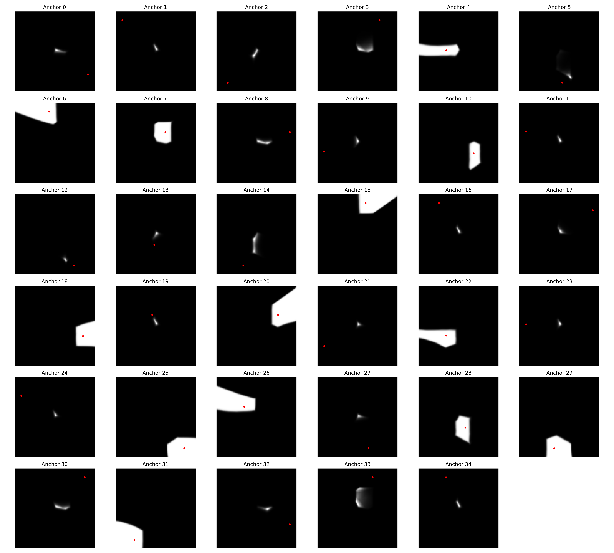

#### 1.1 Trained with SIREN architecture (level: 0.2)
[Link to code](weightTrainingSiren)
Best result with:
* input dimension: 2
* hidden dimension: 128
* number of layers: 6
* frequency multiplier ($\omega$~0~): 5
*	scaling factor (c): 6
* batch size: 256
* epochs: 500
* number of anchors: 100

Reconstructed Mesh Contour and Neural Voronoi Regions

Individual Anchor Influence Grids

#### 2. Trained with normalization formula on final layer and Signed distance fields as input
[Link to code](weightTrainingSigma)

##### Using ReLU (level: 0.05)

Best result with:
* input dimension: 2
* hidden dimension: 64
* number of layers: 4
* batch size: 128
* epochs: 100
* number of anchors: 50

Reconstructed Mesh Contour and Neural Voronoi Regions

Individual Anchor Influence Grids

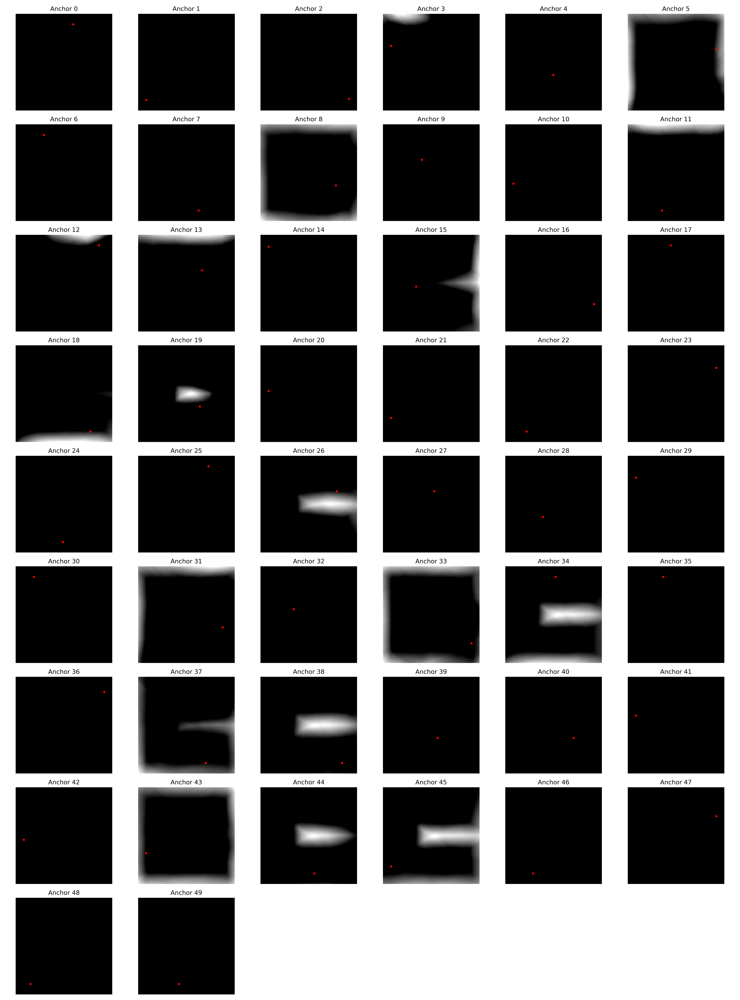

##### Using Sigmoid (level: 0.2)
Best result with:
* input dimension: 2
* hidden dimension: 64
* number of layers: 4
* batch size: 128
* epochs: 100
* number of anchors: 50

Reconstructed Mesh Contour and Neural Voronoi Regions

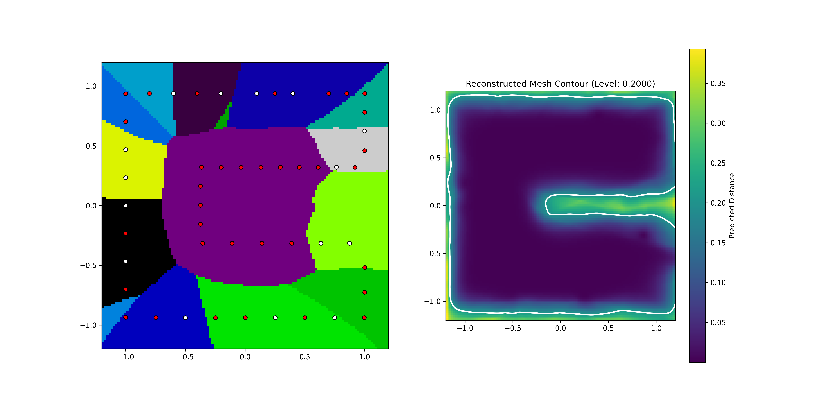

Individual Anchor Influence Grids

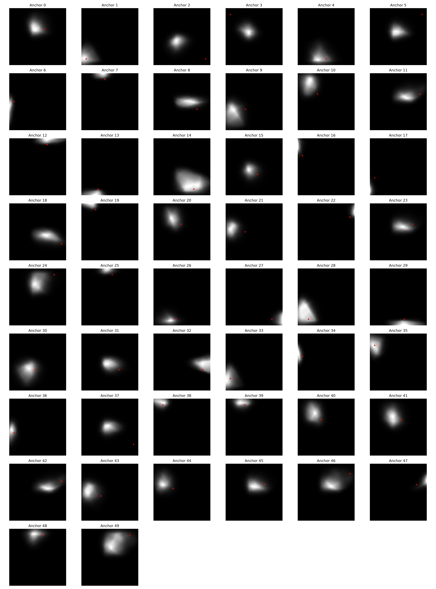

#### 3. Trained with normalization formula on final layer and Unsigned distance fields as input
[Link to code](weightTrainingSigma)

##### Using ReLU (level: 0.2)
Best result with:
* input dimension: 2
* hidden dimension: 64
* number of layers: 4
* batch size: 128
* epochs: 200
* number of anchors: 50

Reconstructed Mesh Contour and Neural Voronoi Regions

Individual Anchor Influence Grids

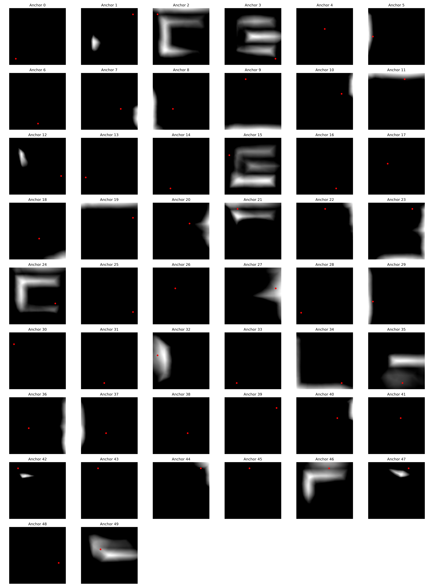

##### Using Sigmoid (level: 0.2)
Best result with:
* input dimension: 2
* hidden dimension: 64
* number of layers: 4
* batch size: 128
* epochs: 100
* number of anchors: 50
* number of random points: 100000

###### 500 epochs and 10000 points

Reconstructed Mesh Contour and Neural Voronoi Regions

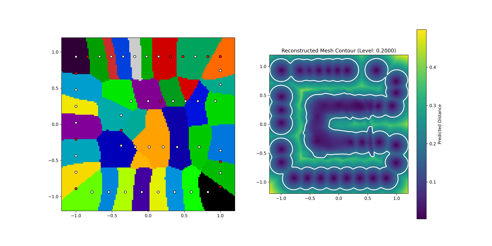

Individual Anchor Influence Grids

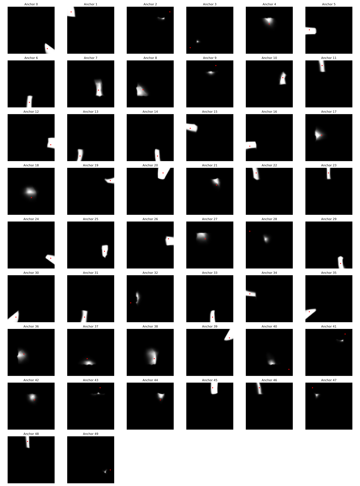

###### 100 epochs and 100000 points

Reconstructed Mesh Contour and Neural Voronoi Regions

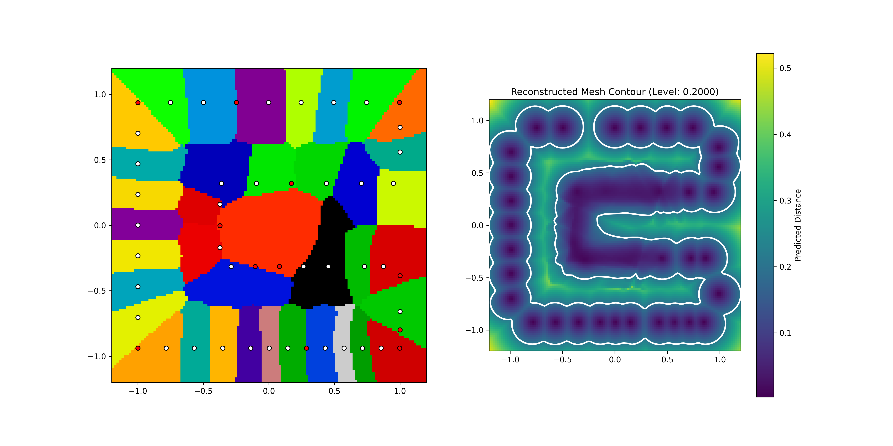

Individual Anchor Influence Grids

---
## Training Signed Distance Fields

#### 1. Trained with Softmax activation on the final layer
[Link to code](signedWeightTraining)
Best result with:
* input dimension: 2
* hidden dimension: 64
* number of layers: 4
* batch size: 128
* epochs: 100
* number of anchors: 50

Reconstructed Mesh Contour and Neural Voronoi Regions

Individual Anchor Influence Grids

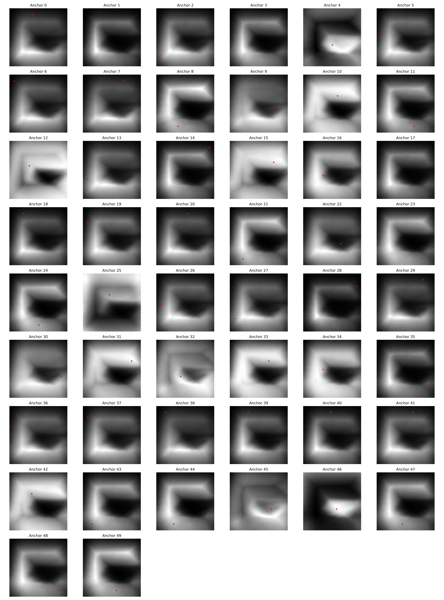

#### 2. Trained with normalization formula on final layer using Sigmoid
[Link to code](signedWeightTrainingSigma)
Best result with:
* input dimension: 2
* hidden dimension: 64
* number of layers: 4
* batch size: 128
* epochs: 100
* number of anchors: 50

Reconstructed Mesh Contour and Neural Voronoi Regions

Individual Anchor Influence Grids

#### 3. Trained with normalization formula on final layer using Softmax and loss function
[Link to code](signedWeightTrainingLoss)
Best result with:
* input dimension: 2
* hidden dimension: 64
* number of layers: 4
* batch size: 128
* epochs: 100
* number of anchors: 50

###### 50 anchors

Reconstructed Mesh Contour and Neural Voronoi Regions

Individual Anchor Influence Grids

Anchor * Distance Influence Grids

Anchor Influence per Point

###### 15 anchors

Reconstructed Mesh Contour and Neural Voronoi Regions

Individual Anchor Influence Grids

Anchor * Distance Influence Grids

Anchor Influence per Point

---
## Experiments for better contours + loss function
Experiments done for signed fields with Softmax on final layer and Relu as activation function.

### U mesh

#### A. Changing number of anchors and epochs
Architecture: 
* batchSize = 128
* lm = 1.0
* sigma = 0.01
* h = 0.2
* noRandomPoints = 8000
* noSurfacePoints = 2000

##### 1. 15 anchors

  
  

     
    <b>100 epochs</b>
  

  

     
    <b>300 epochs</b>
  

##### 2. 50 anchors

  
  

     
    <b>100 epochs</b>
  

  

     
    <b>300 epochs</b>
  

  

     
    <b>500 epochs</b>
  

##### 3. 200 anchors

  
  

     
    <b>100 epochs</b>
  

  

     
    <b>300 epochs</b>
  

#### B. Changing the influence factor of the loss (lm)
Architecture: 
* batchSize = 128
* epochs = 100
* sigma = 0.01
* h = 0.2
* noRandomPoints = 8000
* noSurfacePoints = 2000
* anchors = 50

  
  

     
    <b>0.1 lm</b>
  

  

     
    <b>0.5 lm</b>
  

  

     
    <b>1.0 lm</b>
  

  

     
    <b>1.5 lm</b>
  

#### C. Best result (50 anchors; 300 epochs) with change in lm

  
  

     
    <b>0.9 lm</b>
  

  

     
    <b>1.0 lm</b>
  

### Dolphin mesh

#### A. Changing number of anchors and epochs
Architecture: 
* batchSize = 128
* lm = 1.0
* sigma = 0.01
* h = 0.2
* noRandomPoints = 8000
* noSurfacePoints = 2000

##### 1. 50 anchors

  
  

     
    <b>100 epochs</b>
  

  

     
    <b>300 epochs</b>
  

##### 2. 100 anchors

  
  

     
    <b>100 epochs</b>
  

  

     
    <b>300 epochs</b>
  

  

     
    <b>500 epochs</b>
  

##### 3. 200 anchors

  
  

     
    <b>100 epochs</b>
  

  

     
    <b>300 epochs</b>
  

#### B. Changing the influence factor of the loss (lm)
Architecture: 
* batchSize = 128
* sigma = 0.01
* h = 0.2
* noRandomPoints = 8000
* noSurfacePoints = 2000
* anchors = 100

##### 1. 100 epochs

  
  

     
    <b>0 lm</b>
  

  

     
    <b>0.5 lm</b>
  

  

     
    <b>0.5 lm and 0.01 h</b>
  

  

     
    <b>1 lm</b>
  

##### 2. 300 epochs

  
  

     
    <b>0.1 lm</b>
  

  

     
    <b>0.5 lm</b>
  

  

     
    <b>0.9 lm</b>
  

  

     
    <b>1 lm</b>
  

##### 3. 500 epochs

  
  

     
    <b>0.5 lm</b>
  

  

     
    <b>1 lm</b>
  

#### C. Best result 

### Horse mesh

#### A. Changing number of anchors and epochs
Architecture: 
* batchSize = 128
* lm = 1.0
* sigma = 0.01
* h = 0.2
* noRandomPoints = 8000
* noSurfacePoints = 2000

##### 1. 300 anchors

  
  

     
    <b>100 epochs</b>
  

  

     
    <b>300 epochs</b>
  

  

     
    <b>500 epochs</b>
  

##### 2. 500 anchors

  
  

     
    <b>100 epochs</b>
  

     
    <b>300 epochs</b>
  

#### B. Changing the influence factor of the loss (lm)
Architecture: 
* batchSize = 128
* sigma = 0.01
* h = 0.2
* noRandomPoints = 8000
* noSurfacePoints = 2000
* anchors = 300

##### 1. 300 epochs

  
  

     
    <b>0 lm</b>
  

  

     
    <b>0.5 lm</b>
  

  

     
    <b>0.9 lm</b>
  

  

     
    <b>1 lm</b>
  

### Dragon mesh

#### A. Changing number of anchors and epochs
Architecture: 
* batchSize = 128
* lm = 1.0
* sigma = 0.01
* h = 0.2
* noRandomPoints = 8000
* noSurfacePoints = 2000

##### 1. 100 anchors

  
  

     
    <b>100 epochs</b>
  

  

     
    <b>300 epochs</b>
  

  

     
    <b>500 epochs</b>
  

##### 2. 300 anchors

  
  

     
    <b>100 epochs</b>
  

  

     
    <b>300 epochs</b>
  

  

     
    <b>500 epochs</b>
  

##### 3. 500 anchors

  
  

     
    <b>100 epochs</b>
  

  

     
    <b>300 epochs</b>
  

  

     
    <b>500 epochs</b>
  

#### B. Changing the influence factor of the loss (lm)
Architecture: 
* batchSize = 128
* epochs = 100
* sigma = 0.01
* h = 0.2
* noRandomPoints = 8000
* noSurfacePoints = 2000
* anchors = 300

##### 1. 300 anchors

  
  

     
    <b>0 lm</b>
  

  

     
    <b>0.5 lm</b>
  

  

     
    <b>0.9 lm</b>
  

  

     
    <b>1 lm</b>
  

  

     
    <b>1.5 lm</b>
  

##### 2. 500 anchors

  

     
    <b>0.5 lm</b>
  

  

     
    <b>0.9 lm</b>
  

  

     
    <b>1 lm</b>
  

### Comparison

Different meshes trained at the same architecture but different number of anchors:

Architecture: 
* batchSize = 128
* epochs = 100
* sigma = 0.01
* h = 0.2
* noRandomPoints = 8000
* noSurfacePoints = 2000
* anchors = 300
* lm = 0.9

U: 50 anchors
Dolphin: 100 anchors
Horse: 300 anchors
Dragon: 300 anchors

  
  

     
  

  

     
  

  

     
  

  

     
  

### Experiments

Same mesh trained in different conditions:

Architecture: 
* batchSize = 128
* sigma = 0.01
* h = 0.2
* anchors = 100
* epochs = 100

  
  

     
    <b>(1)</b>
  

  

    (1) architecture: 
    <ul>
      <li>hidden = 256</li>
      <li>noLayers = 2</li>
      <li>lm = 1.0</li>
      <li>noRandomPoints = 8000</li>
      <li>noSurfacePoints = 2000</li>
    </ul>
  
 

  

     
    <b>(2)</b>
  

  

    (2) architecture: 
    <ul>
      <li>hidden = 64</li>
      <li>noLayers = 6</li>
      <li>lm = 1.0</li>
      <li>noRandomPoints = 8000</li>
      <li>noSurfacePoints = 2000</li>
    </ul>
  

  

     
    <b>(3)</b>
  

  

    (3) architecture: 
    <ul>
      <li>hidden = 64</li>
      <li>noLayers = 4</li>
      <li>lm = 0.5</li>
      <li>noRandomPoints = 10000</li>
      <li>noSurfacePoints = 4000</li>
    </ul>
  

  

     
    <b>(4)</b>
  

  

    (4) architecture: 
    <ul>
      <li>hidden = 64</li>
      <li>noLayers = 4</li>
      <li>lm = 1.0</li>
      <li>noRandomPoints = 10000</li>
      <li>noSurfacePoints = 4000</li>
    </ul>
  

  

     
    <b>(5)</b>
  

  

    (5) architecture: 
    <ul>
      <li>hidden = 64</li>
      <li>noLayers = 4</li>
      <li>lm = 1.0</li>
      <li>noRandomPoints = 80000</li>
      <li>noSurfacePoints = 20000</li>
      <li>batchSize = 256</li>
    </ul>
  

  

## Experiments with sigmoid activation function
Experiments done for signed fields with sigmoid function on final layer
[Link to code](signedWeightTrainingSigmaLoss)

Architecture:
* anchors = 100
* noRandomPoints = 2000
* noSurfacePoints = 8000
* inDim = 2
* hidden = 64
* noLayers = 4
* batchSize = 128
* epochs = 300
* lm = 1.0
* sigma = 0.01
* h = 0.2
  

  
  

     
    <b>Voronoi diagram and countours</b>
  

  

     
    <b>Anchors influence</b>
  

  

     
    <b>W*Dist</b>
  

  

     
    <b>Number of contributing anchors per point</b>
  

## Experiments with sin activation function
Experiments done for signed fields with Softmax on final layer and sin function as activation layer (like SIREN architecture)
[Link to code](sineTrainingLoss)

#### A. Diferent architecture dimensions

Architecture: 
* sigma = 0.01
* h = 0.2
* lm = 1.0
* w0 = 30.0
* c = 6.0
* noRandomPoints = 8000
* noSurfacePoints = 2000
* anchors = 100

  
  

     
    <b>(1)</b>
  

  

    (1) architecture: 
    <ul>
      <li>hidden = 64</li>
      <li>noLayers = 4</li>
      <li>batchSize = 128</li>
      <li>epochs = 100</li>
    </ul>
  
 

  

     
    <b>(2)</b>
  

  

    (2) architecture: 
    <ul>
      <li>hidden = 128</li>
      <li>noLayers = 6</li>
      <li>batchSize = 250</li>
      <li>epochs = 300</li>
    </ul>
  

 

     
    <b>(3)</b>
  

  

    (3) architecture: 
    <ul>
      <li>hidden = 128</li>
      <li>noLayers = 6</li>
      <li>batchSize = 250</li>
      <li>epochs = 1000</li>
    </ul>
  

  

     
    <b>(4)</b>
  

  

    (4) architecture: 
    <ul>
      <li>hidden = 256</li>
      <li>noLayers = 8</li>
      <li>batchSize = 250</li>
      <li>epochs = 300</li>
    </ul>
  

  

#### B. Different values for w0

Architecture: 
* sigma = 0.01
* h = 0.2
* lm = 1.0
* c = 6.0
* noRandomPoints = 8000
* noSurfacePoints = 2000
* anchors = 100
* hidden = 128
* noLayers = 6
* batchSize = 250
* epochs = 300

  
  

     
    <b>5 w0</b>
  

  

     
    <b>15 w0</b>
  

  

     
    <b>30 w0</b>
  

#### C. Different number of anchors
Architecture: 
* sigma = 0.01
* h = 0.2
* lm = 1.0
* w0 = 5.0
* c = 6.0
* noRandomPoints = 8000
* noSurfacePoints = 2000
* hidden = 128
* noLayers = 6
* batchSize = 250
* epochs = 300

  
  

     
    <b>3 anchors</b>
  

  

     
    <b>10 anchors</b>
  

  

     
    <b>30 anchors</b>
  

  

     
    <b>50 anchors</b>
  

#### D. Lower lambda factor
Architecture: 
* sigma = 0.01
* h = 0.2
* w0 = 5.0
* c = 6.0
* noRandomPoints = 8000
* noSurfacePoints = 2000
* anchors = 30
* hidden = 128
* noLayers = 6
* batchSize = 250
* epochs = 300

  
  

     
    <b>0 lm</b>
  

  

     
    <b>0.1 lm</b>
  

  

     
    <b>0.5 lm</b>
  

  

     
    <b>1 lm</b>
  

#### E. Best result
Architecture: 
* sigma = 0.01
* h = 0.2
* lm = 0.1
* w0 = 5.0
* c = 6.0
* noRandomPoints = 8000
* noSurfacePoints = 2000
* anchors = 30
* hidden = 128
* noLayers = 6
* batchSize = 250
* epochs = 300

  
  

     
    <b>Voronoi diagram and countours</b>
  

  

     
    <b>Anchors influence</b>
  

  

     
    <b>W*Dist</b>
  

  

     
    <b>Number of contributing anchors per point</b>
  

#### F. Other meshes

Architecture: 
* sigma = 0.01
* h = 0.2
* lm = 0.1
* w0 = 5.0
* c = 6.0
* noRandomPoints = 8000
* noSurfacePoints = 2000
* anchors = 30
* hidden = 128
* noLayers = 6
* batchSize = 250
* epochs = 300

  
  

    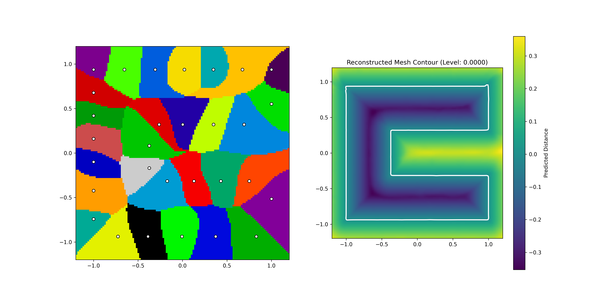 
    <b>U</b>
  

  

     
    <b>Horse</b>
  

  

     
    <b>Dragon</b>
  

## Experiments with Gaussian activation function
Experiments done for signed fields with a Gaussian function on final layer
[Link to code](signedWeightTrainingLoss)

Architecture: 
* sigma = 0.01
* h = 0.2
* lm = 1.0
* noRandomPoints = 8000
* noSurfacePoints = 2000
* hidden = 64
* noLayers = 4
* batchSize = 128
* hGauss = 0.2

#### 100 epochs

  
  

     
    <b>100 anchors</b>
  

  

     
    <b>100 anchors and 0.5 lm</b>
  

  

     
    <b>100 anchors and 0 lm</b>
  

#### 300 epochs

  
  

     
    <b>10 anchors</b>
  

  

     
    <b>50 anchors</b>
  

  

     
    <b>100 anchors</b>
  

#### 500 epochs

  
  

     
    <b>50 anchors</b>
  

  

     
    <b>100 anchors</b>
  

## Experiments with cross-entropy loss
Experiments done initialization of the weights with cross-entropy loss.
[Link to code](signedWeightTrainingCELoss)

Architecture: 
* sigma = 0.01
* h = 0.2
* noRandomPoints = 8000
* noSurfacePoints = 2000
* hidden = 64
* noLayers = 4
* batchSize = 128
* epochs = 100
* lm = 0

### U mesh

#### A. Changing number of anchors - 50 ceEpochs

  
  

     
    <b>10 anchors</b>
  

  

     
    <b>15 anchors</b>
  

  

     
    <b>20 anchors</b>
  

#### B. Changing number of ceEpochs - 20 anchors

  
  

     
    <b>20 ceEpochs</b>
  

  

     
    <b>50 ceEpochs</b>
  

### Dolphin mesh

#### A. Changing number of anchors - 50 ceEpochs

  
  

     
    <b>50 anchors</b>
  

  

     
    <b>100 anchors</b>
  

  

     
    <b>100 anchors and 1 lm</b>
  

  

     
    <b>100 anchors and 1 lm and 0.05 h</b>
  

  

     
    <b>100 anchors and 1 lm and 0.02 h</b>
  

#### B. Changing number of ceEpochs - 100 anchors

  
  

     
    <b>10 ceEpochs</b>
  

  

     
    <b>20 ceEpochs</b>
  

  

     
    <b>50 ceEpochs</b>
  

### Horse mesh

#### A. Changing number of anchors - 50 ceEpochs

  
  

     
    <b>50 anchors</b>
  

  

     
    <b>100 anchors</b>
  

  

     
    <b>150 anchors</b>
  

  

     
    <b>100 anchors and 1 lm</b>
  

  

     
    <b>100 anchors and 1 lm and 0.02h</b>
  

#### B. Changing number of ceEpochs - 100 anchors

  
  

     
    <b>20 ceEpochs</b>
  

  

     
    <b>50 ceEpochs</b>
  

### Dragon mesh

#### A. Changing number of anchors - 50 ceEpochs

  
  

     
    <b>100 anchors</b>
  

  

     
    <b>150 anchors</b>
  

  

     
    <b>200 anchors</b>
  

  

     
    <b>200 anchors and 1 lm 0.02h
    </b>
  

  

     
    <b>200 anchors and 1 lm</b>
  

#### B. Changing number of ceEpochs - 200 anchors

  
  

     
    <b>20 ceEpochs</b>
  

  

     
    <b>50 ceEpochs</b>
  

### Results using only the cross-entropy

#### Dolphin - 50 anchors

  
  

     
    <b>10 ceEpochs</b>
  

  

     
    <b>30 ceEpochs</b>
  

#### Dolphin - 100 anchors

  
  

     
    <b>10 ceEpochs</b>
  

  

     
    <b>20 ceEpochs</b>
  

  

     
    <b>50 ceEpochs</b>
  

  

  

     
    <b>100 ceEpochs</b>
  

#### Horse - 100 anchors

  
  

     
    <b>10 ceEpochs</b>
  

  

     
    <b>20 ceEpochs</b>
  

  

     
    <b>50 ceEpochs</b>
  

#### Dragon - 200 anchors

  
  

     
    <b>10 ceEpochs</b>
  

  

     
    <b>20 ceEpochs</b>
  

  

     
    <b>50 ceEpochs</b>
  

  

     
    <b>100 ceEpochs</b>
  

## Experiments with cross-entropy loss and sparsemax activation
Experiments done with initialization of the weights with cross-entropy loss and sparsemax ans the final layer activation function.
[Link to code](signedWeightTrainingSparsemax)

Architecture: 
* sigma = 0.01
* h = 0.2
* noRandomPoints = 8000
* noSurfacePoints = 2000
* hidden = 64
* noLayers = 4
* batchSize = 128
* epochs = 100
* ce = 10

### Dolphin mesh - 100 anchors

#### 1. Sparsemax

  
  

     
    <b>0 lm</b>
  

  

     
    <b>0.5 lm</b>
  

  

     
    <b>1 lm</b>
  

  

     
    <b>1 lm and 0.02h</b>
  

#### 2. Entmax15

  
  

     
    <b>0 lm</b>
  

  

     
    <b>1 lm</b>
  

### Dragon mesh - 200 anchors

#### 1. Sparsemax

  
  

     
    <b>0 lm</b>
  

  

     
    <b>0.5 lm</b>
  

  

     
    <b>1 lm</b>
  

  

     
    <b>1 lm and 0.02h</b>
  

  

     
    <b>Another Sparsemax implementation</b>
  

#### 2. Entmax15

  
  

     
    <b>0 lm</b>
  

  

     
    <b>1 lm</b>
  

  

     
    <b>1 lm and 0.02h</b>
  

### Comparison between training with cross-entropy, SDF or both

Architecture: 
* sigma = 0.01
* h = 0.2
* noRandomPoints = 8000
* noSurfacePoints = 2000
* hidden = 64
* noLayers = 4
* batchSize = 128
* lm = 0

#### Dolphin - 50 anchors

* epochs = 100
* ceEpochs = 10

  
  

     
    <b>Cross-entropy</b>
  

  

     
    <b>Both</b>
  

  

     
    <b>SDF</b>
  

#### Horse - 100 anchors

* epochs = 100
* ceEpochs = 20

  
  

     
    <b>Cross-entropy</b>
  

  

     
    <b>Both</b>
  

  

     
    <b>SDF</b>
  

#### Dragon - 200 anchors

* epochs = 100
* ceEpochs = 20

  
  

     
    <b>Cross-entropy</b>
  

  

     
    <b>Both</b>
  

  

     
    <b>SDF</b>
  

